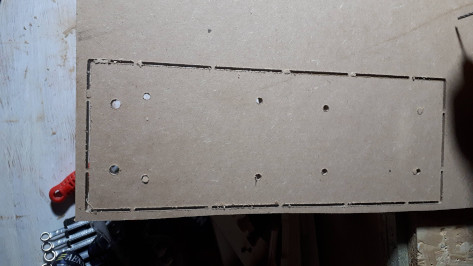

wodiyc
++++++

WOoden DIY CNC

python application to generate G-Code for a CNC machine.

*This project is unfinished.  Nevertheless some
parts are already useful.*

Introduction
============

During the years 2004 to 2006 some technical drawings of a wooden CNC
milling machine appeared in the Internet.  They were created by
someone called 'jgro'.  There are some versions of this machine and
it is still very popular - but it looks that nobody ever updated
the plans.

These plans had three major disadvantages:

#. All items and measures were given in inch.  Because I'm living in
   Europe, it is mostly impossible to get the items and tools to
   manufacture using the original plans.

#. A lot of 'additional' items are not available any longer.

#. The plans were not intended to be used in a CNC router itself.

Usage
=====

Checkout this project.

The file host_cnc.yaml contains the properties of the CNC machine
you are creating the GCode for.  Please adapt it to your needs.

The file wodiyc.yaml contains all the measurements of the CNC machine
to create (the target CNC machine). Adapt it as you want.

.. code:: bash

   python3 wodiyc/wodiyc_generate.py --wodiyc wodiyc.yaml --host-cnc host_cnc.yaml

Requirements
============

A small list of requirements of this project:

#. Use metric measurements, items and tools

#. All items and tools should be available today and should be
   (somewhat) cheap.

#. The complete plans should be done in a way that they can be used
   in already build CNC milling machines to produce new ones.

#. The complete (software-) tool chain should be open source and
   available within the most common Linux distributions.

#. All parts are created with bridges.

The current toolchain is: python and linuxcnc.

Parts
=====

This is the list of parts that already is available.

A complete list including images can be found in a separate Readme_.

.. _Readme: wodiyc/parts/Readme.rst

#. Adjustment Block: this is used for fixing the tubes and bearings.

#. Anti Backlash Nut

#. Reference: a small part to get the measurements correct

#. Support Bearing: used for manufacturing the linear bearings

#. Support: used for manufacuring parts with holes in the edge

#. ZAxis Bearing Support

#. ZAxis Linear Bearing

#. ZAxis Platform Back

#. ZAxis Platform Front

Notes
=====

Welcome to all who want to participate or improve.  Please just fork,
improve or change and send me a merge request.

Please note that I'm not a mechanics engineer.  All plans and the
generaded G-Code might contain errors and bugs.  Use them with care.

The license is chosen in a way that commercial use of the plans and of
course of any CNC milling machine is allowed.  But if you change the
plans you have also to publish the changes.

Status
======

This is not that important as this runs only pep8 and pylint.

.. image:: https://travis-ci.com/florath/wodiyc.svg?branch=master

Happy Milling.

Andreas Florath

andreas@florath.net
