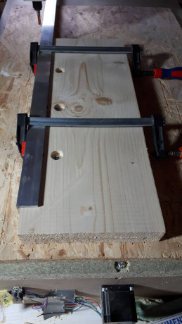
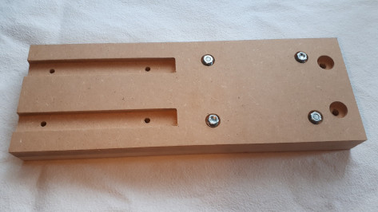

Parts
+++++

AntiBacklashNut
===============
The anti backlash nut is self-made as I did not found any
for M12.  It uses two the same blocks from aluminuim.  The picture
shows the raw - without the thread.

Reference
=========
This part is used only as measurement reference. It should
be created on the host CNC machine and all the measurements
should be checked.

.. image:: ../../images/Reference.jpg
   :align: center

SupportBearing
==============
This part is used for manufacturing the linear bearing.

Support
=======
This is used for manufacuring other parts. It is fixed on the
CNC tables with M6 screws. Other parts can be fixed with clamps
to mill the edges.

.. image:: ../../images/Support-Front.jpg

ZAxisBearingSupport
===================
This part fixes the Z axis to the linear bearing.

ZAxisPlatform
=============
The tool is mounted here.

The original plan uses a 19mm MDF - which bends under a medium force.
Therefore the current approach uses two 16mm MDF plates glued together.

